# 2024//11/12
## 技巧合集
### 一、是字结构
>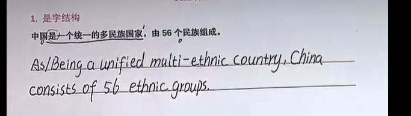
> As+n 结构
> 由什么组成   使用consist of 

### 二、的字结构
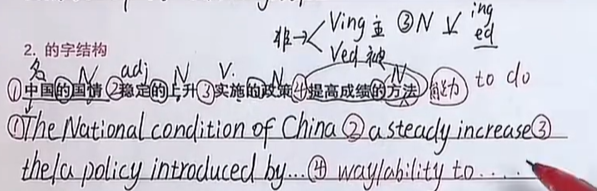
> 1. 名词 的  名词  使用of 连接
> 2.  形容词 的 名词    直接写即可
> 3. 动词 的 名   V 的 N  结构  直接使用非谓语结构
> 4. 的 后面 接的是什么手段、方法、措施之类的，直接使用to do 进行连接

### 三、无动词情况处理
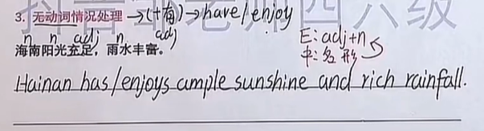
> 直接 补充 有 作为动词  has/have/enjoy
> 阳光充足 充足的阳光  adj+n

### 四、时态问题
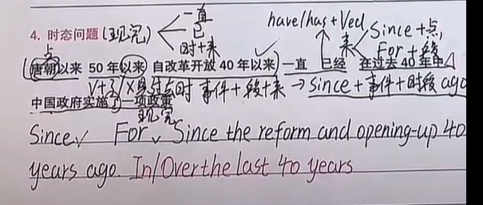
> 现在完成时的标志词 一直 已  时间＋来 V＋了
> 时间点 使用 since  时间段使用 for 
> 时间＋时间段＋来 since+事件+时间段+ago
> 在过去.....年以来  使用 In/Over last 40 years

### 五、特殊时间的处理
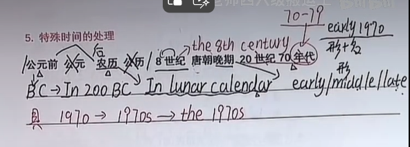
> 公元前 -----> BC  公元-----不翻译
> 农历   ------ In lunar calendar  公历-----不翻译
> 8世纪 ----- 使用序数词 the 8th century
> 唐朝晚期 ---- 早 中 晚 ---- early/middle/late
> 1970年代 ----  the 1970s
>

### 六、 排列第几/仅次于
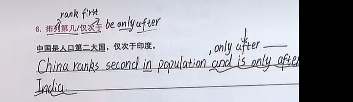
> 1. 排列第几 rank XXX
> 2. 仅次于 be only after / ，only after
>
### 七、形容词排序问题
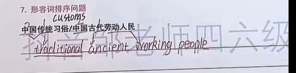
> 中国传统习俗 先翻译 传统 再翻译中国

### 八、之一的结构问题
> 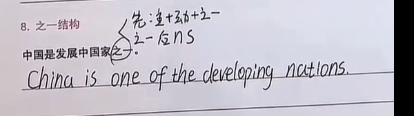
> 之一后面 名词要加s

### 九、隐藏的被动
>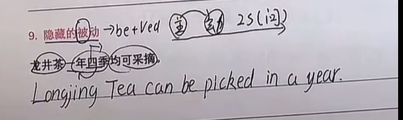

### 十、随着 结构
>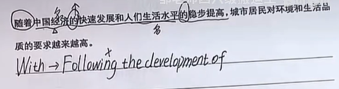
> 1. 随着 + 句子  使用 As
> 2. 随着 + 名词  使用 with
> 3. 如果使用 with 可以使用following 去替换
>

### 十一、得到 翻译技巧
>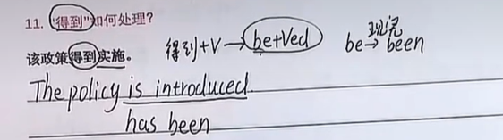
> 得到+V --- 直接变成 be+Ved

### 十二、特殊有字结构处理
>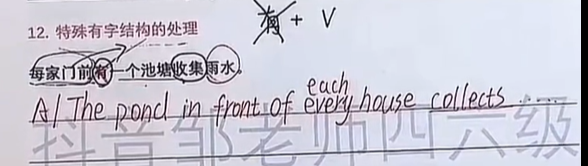
> 有 + V
> 直接不翻译有字

### 十三、基于/根据/作为   放在哪里
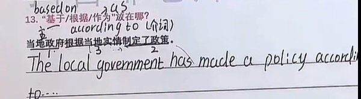
> 这些词 是需要作为介词 的
> 所以一般是将其放在最后

### 十四、方式状语的处理
>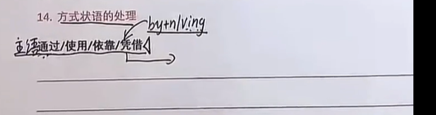
> 遇到这些词 直接使用 by+n/V-ing
>

### 十五、双动词 怎么处理
>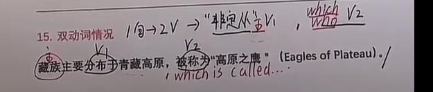

### 十六、民族相关词翻译
>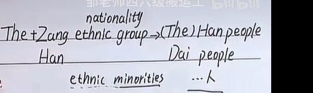
>什么什么民族  ----  The Xxx ethic group
> XXX 人 ---- Han people
>
### 十七、三动词 翻译处理

>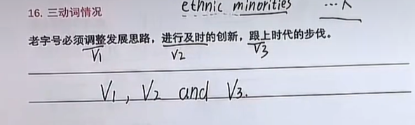